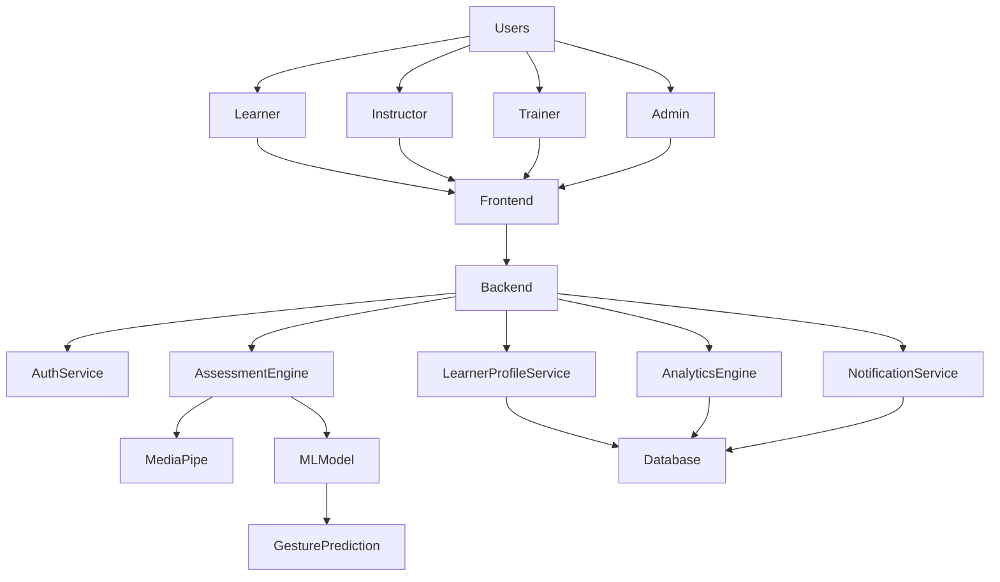
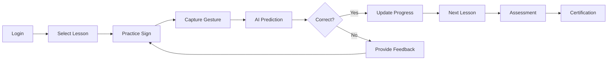
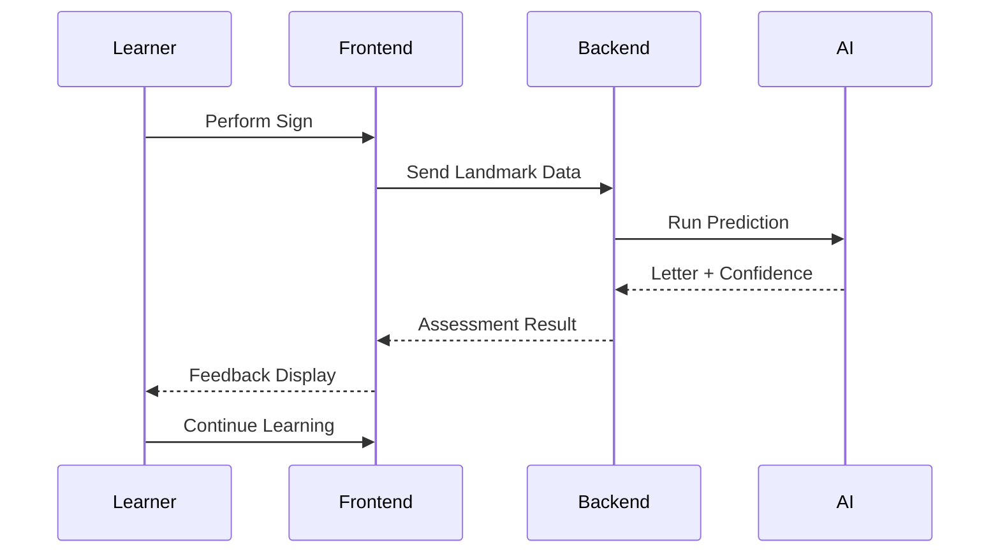
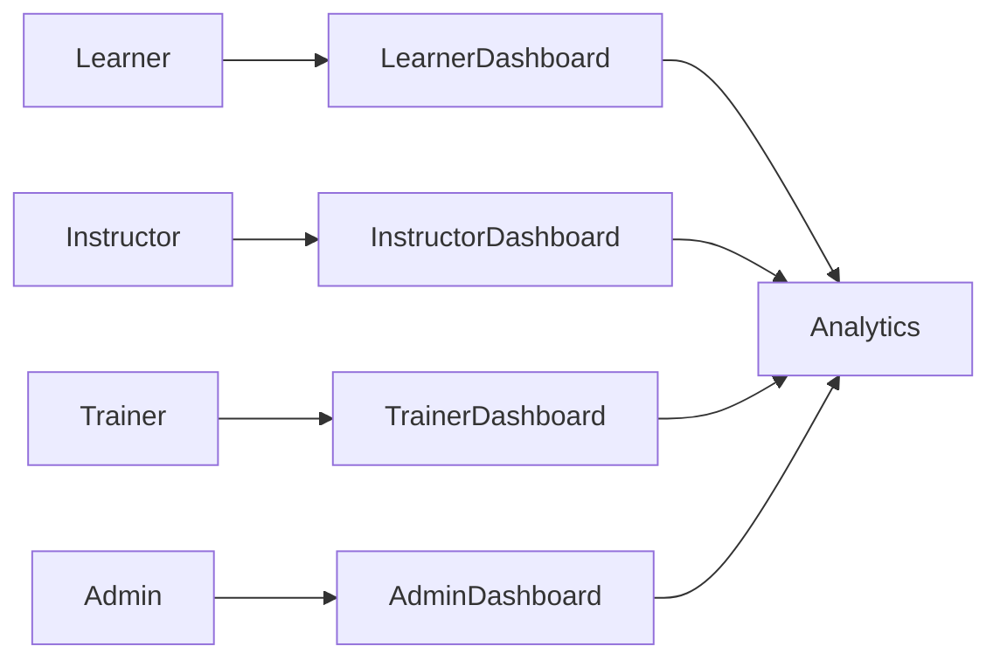
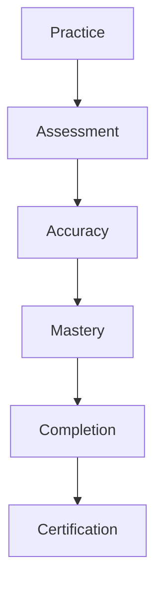
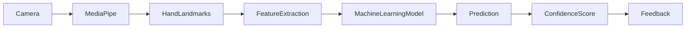

### AI-Powered Sign Language Learning & Assessment Platform

<p align="center">


</p>

<p align="center">
  <strong>Learn • Practice • Assess • Improve • Certify</strong>
</p>

---

# 📖 Overview

SignSync is an AI-powered Sign Language Learning & Assessment Platform designed to make sign language education more accessible, interactive, and measurable.

The platform combines Computer Vision, Machine Learning, Learning Analytics, and Role-Based Learning Management to provide:

- Real-time sign language recognition
- Personalized learning experiences
- Automated assessments
- Progress tracking
- Certification readiness monitoring
- Advanced analytics dashboards

SignSync supports learners, instructors, accessibility trainers, and administrators through dedicated dashboards and intelligent reporting tools.

---

# 🎯 Objectives

- Improve accessibility to sign language education
- Provide AI-assisted learning experiences
- Measure learner performance accurately
- Deliver personalized recommendations
- Support instructors with analytics
- Enable certification and progress tracking

---

# ✨ Core Features

## 🤖 AI Gesture Recognition

- Real-time sign detection
- Hand landmark tracking
- Finger position analysis
- Gesture classification
- Confidence scoring
- Live visual feedback

---

## 📚 Learning Module

- Alphabet learning
- Guided practice sessions
- Progressive lesson structure
- Personalized learning path
- Weak gesture identification
- Adaptive recommendations

---

## 📝 Assessment Engine

- Real-time assessments
- Automated scoring
- Performance evaluation
- Accuracy monitoring
- Assessment history
- Progress reports

---

## 🏆 Certification System

- Lesson completion tracking
- Certification eligibility checks
- Mastery validation
- Achievement monitoring
- Progress milestones

---

## 📊 Analytics Dashboard

- Performance trends
- Accuracy reports
- Completion statistics
- Weakness analysis
- Learning insights
- Dashboard visualizations

---

## 🔔 Notification System

- Lesson completion alerts
- Assessment reminders
- Achievement notifications
- Progress updates
- Certification readiness alerts

---

# 👥 User Roles

## 👨‍🎓 Learner

Learners can:

- Practice sign language alphabets
- Receive AI-powered feedback
- Complete assessments
- Track progress
- View learning analytics
- Monitor certification readiness

---

## 👨‍🏫 Instructor

Instructors can:

- Monitor learner performance
- Review assessment reports
- Analyze progress trends
- Track mastery levels
- View class analytics

---

## ♿ Accessibility Trainer

Accessibility Trainers can:

- Evaluate learner development
- Review assessment outcomes
- Monitor certification readiness
- Analyze learning behavior
- Generate progress reports

---

## 🛠 Administrator

Administrators can:

- Manage users
- Manage learning content
- Monitor system activity
- Access platform analytics
- Configure system settings

---

# 🏗 System Architecture



---

# 🔄 Learning Workflow



---

# 🎥 Real-Time Assessment Workflow



---

# 📊 Dashboard Ecosystem



---

# 📈 Learner Progress Model



---

# 🧠 AI Assessment Pipeline



---

# 📋 Performance Metrics

The platform evaluates learners using multiple indicators:

| Metric | Description |
|----------|-------------|
| Accuracy | Correct predictions percentage |
| Confidence | AI confidence score |
| Attempts | Number of practice attempts |
| Completion Rate | Lessons completed |
| Mastery Level | Skill proficiency |
| Assessment Score | Evaluation result |

---

# 💻 Technology Stack

## Frontend

- React.js
- React Router
- Axios
- Bootstrap
- Chart.js

---

## Backend

- Python
- Flask
- REST APIs

---

## AI & Computer Vision

- MediaPipe
- OpenCV
- Scikit-Learn
- NumPy
- Pandas

---

## Authentication

- JWT Authentication
- Role-Based Access Control

---

## Database

- JSON Storage
- Profile Persistence
- Assessment Records

---

## Deployment

- GitHub
- Render
- Docker Ready

---

# 📁 Project Structure

```text
SignSync
│
├── backend
│   ├── app
│   │   ├── ai
│   │   ├── routes
│   │   ├── services
│   │   ├── database
│   │   └── models
│
├── frontend
│   ├── src
│   │   ├── components
│   │   ├── pages
│   │   ├── routes
│   │   ├── services
│   │   └── assets
│
├── scripts
├── experiments
├── README.md
└── requirements.txt
```
# 📸 Screenshots

## 👨‍🎓 Student Dashboard

### Dashboard Overview


### Learning Progress


### Practice Session


### AI Assessment


### Progress Analytics


### Assessment Results


### Learning Recommendations


---

## 👨‍🏫 Instructor Dashboard

### Instructor Overview


### Student Performance Tracking


### Individual Learner Analytics


### Assessment Reports


---

## ♿ Accessibility Trainer Dashboard

### Trainer Overview


### Progress Monitoring


### Training Analytics


---

## 🛠 Admin Dashboard

### System Overview


### User Management


### Platform Analytics


### System Monitoring


---

# 📊 Future Enhancements

- Word Recognition
- Sentence Recognition
- Mobile Application
- Multiplayer Learning Sessions
- AI Tutor Assistant
- Cloud Analytics
- Advanced Certifications
- Voice Assisted Learning

---

# 🎓 Academic Context

This project was developed as part of an academic software engineering initiative focused on:

- Accessibility Technology
- Artificial Intelligence
- Machine Learning
- Educational Technology
- Learning Analytics
- Human-Computer Interaction

---

# 🤝 Contributors

### Chintana Projects

Developed with the goal of making sign language learning more accessible through Artificial Intelligence and Modern Educational Technology.

---

<p align="center">
  <strong>🤟 Bridging Communication Through AI-Powered Learning</strong>
</p>
